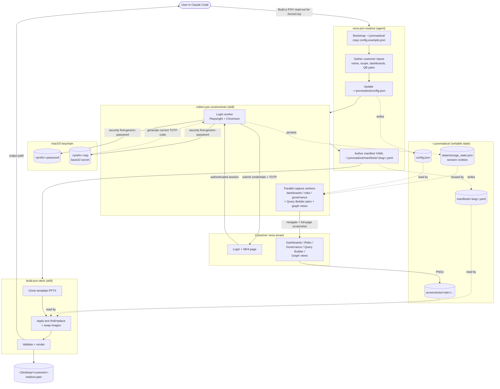

# povreadout

A Claude Code plugin that produces a customer-branded Veza POV (Proof of Value) executive read-out PowerPoint deck end-to-end: authenticate to the customer's Veza tenant, capture screenshots in parallel headless browsers, then assemble a final PPTX from a template.

Bundles one agent and two skills:

| Component | What it does |
|---|---|
| **`veza-pov-readout`** (agent) | Orchestrates the full flow: gathers customer inputs, edits capture config, drives the skills, authors the manifest, reports back what to review by hand. |
| **`collect-pov-screenshots`** (skill) | macOS-keychain login (password + TOTP), parallel screenshot workers (dashboards / risks / governance), Query Builder pair captures, graph view captures. |
| **`build-pov-deck`** (skill) | Clones a template PPTX, applies text find/replace, swaps in captured screenshots, validates, renders the output file. |

## How it works



## Install

```
/plugin install https://github.com/pvolu-vz/povreadout.git
```

Or, while developing the plugin locally:

```bash
claude --plugin-dir /path/to/povreadout
```

## Prerequisites

The skills shell out to Python and Playwright. Install once:

```bash
pip3 install python-pptx PyYAML playwright
python3 -m playwright install chromium
```

The login flow reads credentials from the macOS keychain. For each Veza tenant you'll work with, add two entries (replace `<prefix>` with a short tag like `pov-f` and `<account>` with the login email):

```bash
security add-generic-password -a "<prefix>-password" -s "<account>" -w
security add-generic-password -a "<prefix>-totp"     -s "<account>" -w
```

For the TOTP entry, paste the base32 secret from "set up authenticator app" (often behind a "can't scan QR?" link).

## Where files live after install

The plugin's read-only assets (scripts, slide template, example manifests) live under the plugin install directory and are referenced via `${CLAUDE_PLUGIN_ROOT}`. **Writable** state lives under `~/.povreadout/`:

| Path | Purpose |
|---|---|
| `~/.povreadout/config.json` | Capture config — site URL, dashboard URLs, Query Builder pairs. Edited per customer by the agent. |
| `~/.povreadout/state/storage_state.json` | Playwright session cookies. Rewritten on each login. Treat as a password. |
| `~/.povreadout/screenshots/<site>/...` | Captured PNGs, namespaced by `site` in config. |
| `~/.povreadout/manifests/<customer-slug>.yaml` | Generated build manifests. |

The agent bootstraps this directory on first run (copies `config.example.json` into place).

## Usage

In Claude Code, ask the agent:

> Build a POV read-out for AcmeCorp.

The `veza-pov-readout` agent will walk through Phase 0–6: gather inputs, update `~/.povreadout/config.json`, drive the screenshot capture, author a manifest, render the PPTX. The output lands on your Desktop by default.

The full operator's guide is in [agents/veza-pov-readout.README.md](agents/veza-pov-readout.README.md) — read it before your first run, especially the "Tips that come from running it" section.

## License

MIT
